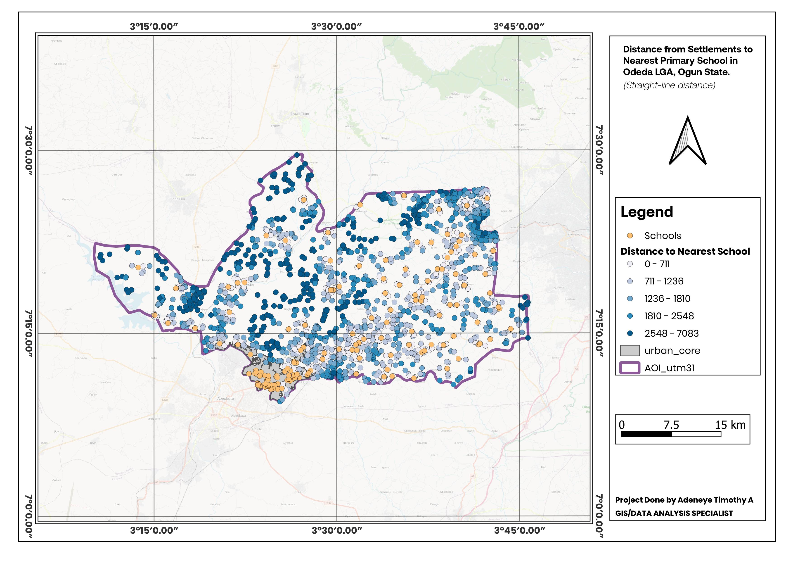

# SchoolReach: Primary School Accessibility in Odeda LGA

Which settlements in Odeda LGA, Ogun State have inadequate road-based access to primary schools?

Built over twelve months as part of GeoDev Lab Africa. This repository covers Month 1: getting the right data, standardizing it, and running a first analysis.

## Key Finding (Month 1)

Across 1,528 ordinary settlements in Odeda LGA, the median straight-line distance to the nearest primary school is approximately **1,538 m** (mean ≈1,679 m). **190 settlements (12.4%) sit more than 3 km from the nearest school in a straight line**, and 15 settlements (1%) are more than 5 km away. Since these are straight-line distances, true road-based distance — the actual question this project is built around — is almost certainly higher for these settlements, not lower. Four large settlements were excluded from this figure because they geometrically contain multiple schools within their own boundary, making "distance to nearest school" meaningless for them specifically; see `month-1-summary.md` for the full explanation.

## Project Brief (Week 1)

[project-brief.md](./project-brief.md) — the question, why it matters, every dataset needed and where it comes from, and what the finished system would look like.

## Data Notes (Weeks 2–3)

[data-notes.md](./data-notes.md) — every dataset downloaded, with source, version, and coverage notes ([Week 2](./data-notes.md#grid3-nigeria-administrative-boundaries-odeda-lga)), plus the CRS standardization and quality checks run on all layers ([Week 3](./data-notes.md#crs-and-reprojection-week-3)).

## Analysis and Map (Week 4)

[month-1-summary.md](./month-1-summary.md) — the spatial operation run (nearest-distance join, settlements to schools), what was expected versus what was found, and the genuine data-quality discovery made along the way (large settlement polygons that contain multiple schools, producing tied zero-distance matches).

## Data Sources (summary)

| Dataset | Provider |
|---|---|
| Odeda LGA boundary | GRID3 Nigeria (fallback: HDX COD-AB) |
| Settlements | GRID3 (Ogun State extract) |
| Primary schools | GRID3 Nigeria Schools |
| Road network | OpenStreetMap (via QuickOSM) |
| Population (age-structured) | WorldPop |

Full provenance (versions, download dates, licenses) is in [data-notes.md](./data-notes.md).

## Status and Next Steps

Month 1 complete. Straight-line distance is a deliberate placeholder for the project's actual road-based question — road-network routing, a defined "inadequate access" threshold, and treatment of the four excluded urban-core settlements are the open items carried into Month 2 (see the "What data I still need" section of [month-1-summary.md](./month-1-summary.md)).

## Month 2: development environment and early python

- Week 5: set up python, VS Code and the terminal. hello.py runs.
